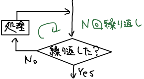

# プログラミング演習1,2
## 目次

1. [概要](#anchor1)
2. [C言語](#anchor2)
3. [printf関数](#anchor3)
4. [コメントアウト](#anchor4)
5. [変数とprintf関数](#anchor5)
6. [scanf関数](#anchor6)
7. [変数と型](#anchor7)
8. [四則演算](#anchor8)

9. [条件分岐if](#anchor9)
10. [論理和,論理積,否定](#anchor10)

11. [switch文](#anchor11)

12. [ループ処理 do while](#anchor12)
13. [ループ処理 while](#anchor13)

14. [ループ処理 for](#anchor14)

15. [配列変数](#anchor15)

16. [関数](#anchor16)
17. [void型](#anchor17)

18. [グローバル変数](#anchor18)

19. [静的変数 static](#anchor19)

20. [再帰呼び出し](#anchor20)

21. [ファイル入出力](#anchor21)

22. [宿題と解答](#anchor22)


<a id="anchor1"></a>

## 1. 概要
プログラミング1,2の授業範囲


<a id="anchor2"></a>

## 2. C言語

```c
#include<stdio.h>
int main(){
    printf("Hello World! \n");
    return 0;
}
```
実行結果
```
Hello World!
```
> printf("") : ""内の文字列を表示
>
> return 0 : main関数の終了

main関数の中身を{}で書き、実行させたい命令を1つずつ ;(セミコロン) で区切りながら書く(命令の最後に `;`)。

改行したい時は \n (¥n)を書く。

includeはあらかじめ用意されたライブラリやヘッダーを読み込むための命令。
使う命令の種類に応じて #include で指定するファイルが異なる(今回はprintfの命令を使うので stdio.h を指定した)。

stdio.h(スタンダードIO)は標準的な入出力関数がいろいろ定義されている。
これを読み込まないとprintfを実行できない。

main関数の中に書いたプログラムを順に実行する。


<a id="anchor3"></a>

## 3. printf関数
\n をprintfに入れて改行されることを確かめる。
```c
#include<stdio.h>
int main(void){
    printf("Hello \n\nWorld!\n");
    return 0;
}
```
実行結果
```
Hello

World!
```


<a id="anchor4"></a>

## 4. コメントアウト
プログラムに無視されるので、メモや説明を /* と*/ で囲んだ部分に記述できる。

// で区切ると、その行のそれより後ろは無視される。

```c
#include<stdio.h>
/* ここにコメントできる */
int main(){
    printf("Hello World! \n"); /*コメントできる*/
    printf("Yeah!"); // コメントアウトできる
}
```


<a id="anchor5"></a>

## 5. 変数とprintf関数
変数は宣言してから使う。(例) int hensu;
> int : 型
>
> hensu : 変数名

代入は hensu = 5; のように行う。

printf()で変数の内容も表示できる。
```
int hensu; hensu = 5;
printf("hensuの値は%dです",hensu);
```
> %dは""内に複数表示できる。
>
> %dの数と同じだけ変数を後ろに置く。
>
> 順番に表示される。

```c
#include<stdio.h>
int main(){
    int mon; // 変数という。値を保存してくれる入れ物。整数型変数利用「int」
    int day; // 変数の名前は自由に付けられる。
    mon = 4; // 変数monに4を代入
    day = 13; // 変数dayに13を代入
    printf("今日は%d月%d日です。\n",mon,day);
    return 0; // プログラムの終了
}
```


<a id="anchor6"></a>

## 6. scanf関数

scanf関数はユーザーから指定されたデータを変数に格納する関数。

```
int a;
scanf("%d",&a); // printf()とは違い、& が必要。入力値がaに代入される。
```

```c
#include<stdio.h>
int main(){
    int a;
    scanf("%d",&a);
    printf("入力した整数は%dです。\n",a);
    return 0;
}
```
入力
```
3
```
実行結果
```
入力した整数は3です。
```


<a id="anchor7"></a>

## 7. 変数と型

変数名は予約語以外ならなんでもいい。
> 予約語 : int, main, includeなど

```
int a,b,c; // 同時に複数の変数を宣言
int year = 100; // 宣言時に代入できる
```

a, b, cなどはなんの変数か分かりにくいので、day, mon, yearなどわかりやすくするといい。

慣例で自作の変数名は大文字で始め、目的がわかるようにつける。
(例) int Birthday_Day;

```c
#include<stdio.h>
int main(){
    int a; // 整数型 : 整数を扱う(32bit=2進数32桁分)。フォーマット指定子は%d
    double x; // 浮動小数点型 : 小数を扱う(64bit=2進数64桁分)。フォーマット指定子は%lf
    int hensu1 = 100;
    double hensu2 = 0.1234;
    printf("変数の値は%dです。",hensu1);
    printf("変数の値は%lfです。",hensu2);
}
```


<a id="anchor8"></a>

## 8. 四則演算

```c
#include<stdio.h>
int main(){
    int a1,a2,a3,a4,a5,b;
    b=10; // 計算はすべて右辺を計算して左辺に代入
    a1 = b + 3;
    a2 = b - 3;
    a3 = b * 3;
    a4 = b / 3; // 整数型なので切り捨て
    a5 = b % 3;
    printf("足し算:%d,引き算:%d,かけ算:%d,割り算:%d,剰余:%d",a1,a2,a3,a4,a5);
}
```


<a id="anchor9"></a>

## 9. 条件分岐if
if文によって変数の値によって条件を分岐できる。

```
if (条件式)
  文1; // 条件式が真のとき実行
else
  文2; // 条件式が偽のとき実行
```
elseはなくてもいい。ない場合は偽のとき何も実行されない。


```c
#include<stdio.h>
int main(){
    int a;
    printf("整数を入力してください");
    scanf("%d",&a);
    if(a % 2 == 0)
        printf("aは偶数\n");
    else
        printf("aは奇数\n");
    return 0;
}
```
> ### 比較演算子
> - a < b : aはbより小さい
> - a <= b : aはbより小さいか等しい
> - a > b : aはbより大きい
> - a >= b : aはbより大きいか等しい
> - a == b : aはbと等しい
> - a != b : aとbは等しくない

複合文 : if文の後の文が複数の時は{}でくくる
```
if (条件文){
  文1;
  文2; // if文の中にif文があってもいい
}else{
  文1;
  文2;
}
```

```c
#include<stdio.h>
int main(){
    int a;
    printf("整数を入力してください");
    scanf("%d",&a);
    if(a % 2 == 0)
        printf("2の倍数です\n");
    else if(a % 3 == 0)
        printf("3の倍数です\n");
    else
        printf("2の倍数でも3の倍数でもない\n");
    return 0;
}
```


<a id="anchor10"></a>

## 10. 論理和,論理積,否定

論理和 A+B : ((条件式A)||(条件式B))
> 条件式Aが真または条件式Bが真なら真

論理積 A×B : ((条件式A)&&(条件式B))
> 条件式Aが真かつ条件式Bが真なら真

否定 $\bar{A}$ : !(条件式A)
> 条件式Aが真なら偽、偽なら真

例えば次の場合は、"2の倍数だが3の倍数でない"の否定だから、"aは2の倍数でない"または"aは3の倍数"

```
if(!((a%2==0)&&!(a%3==0)))
```


真と偽の値 : C言語では0は偽、0以外は真を表す。繰り返し文で使われることが多い。

if(0) : 常に偽となるから、if文の後は実行されない

if(1) : 常に真


<a id="anchor11"></a>

## 11. switch文

```
switch(式){ // 判定する式
  case 値1: // 条件の値
    処理1; // 式が条件の値のときbreak;まで実行
    break;
  case 値2: // caseの後ろは : (コロン)を使う
    処理2-1;
    処理2-2; // 式が値2なら処理2-1,2-2を実行し、switch文の後の処理に飛ぶ
    break;
} // aがどれでもない場合switch文の後に飛ぶ
```
breakがない場合、処理はそのまま続く。次の場合、a=1なら処理1,2,3が実行される。
```
switch(a){
  case 1:
    処理1;
  case 2:
    処理2;
  case 3:
    処理3;
    break;
}
```

switch文で”どのcaseにも合致しない”場合に実行したい処理はdefaultに書く。
```
switch(a){
  case 1:
    処理1;
    break;
  case 2:
    処理2;
    break;
  default:
    処理3;
    break;
}
```

switch文は整数か、整数になる式しか使えないが、多くの整数値によって処理を変えたいときは便利。

次の場合では、a=1,2のときは処理1と2、a=3,4のときは処理2のみを実行できる。
```
switch(a){
  case 1:
  case 2:
    処理1;
  case 3:
  case 4:
    処理2;
    break;
}
```

様々なaの値で次のコードを実行して出力を確かめる。
```c
#include<stdio.h>
int main(){
    int a;
    scanf("%d",&a);
    switch(a){
        case 1:
            printf("ケース%dを実行 \n",a);
            break;
        case 2:
            printf("ケース%dを実行 \n",a);
            printf("ケース%dを実行 \n",a);
            break;
        case 3:
            printf("ケース%dを実行 \n",a);
        case 4:
            printf("ケース%dを実行 \n",a);
            break;
        default:
            printf("デフォルトを実行 \n");
            break;
    }
}
```


<a id="anchor12"></a>

## 12. ループ処理 do while


条件式を満たしている間は処理が繰り返し実行される。
処理を行ってから条件判別を行うので必ず一回は実行される。

```
do{
  処理;
  処理;
}
while(条件式); // 条件式はif文の時と同じ
```

```c
#include<stdio.h>
int main(){
    int n = 10;
    do{
        printf("n=%d\n",n);
        n = n - 1;
    }
    while(n > 0);
}
```
実行結果
```
n=10
n=9
n=8
n=7
n=6
n=5
n=4
n=3
n=2
n=1
```


<a id="anchor13"></a>

## 13. ループ処理 while


条件式を満たしている間は処理が繰り返し実行される。
最初に満たしていなければ何も実行しない。

```
while(条件式){
  処理;
  処理;
}
```

```c
#include<stdio.h>
int main(){
  int a = 1, max, sum = 0;
  printf("正の整数を入力してください: \n");
  scanf("%d",&max);
  while(a <= max){
    sum = sum + a;
    a = a + 1;}
  printf("1から%dの合計は%dです。\n",max,sum);
}
```

while(1)のとき、条件は常に真となり無限ループとなる。break;で抜けられる。

```c
#include<stdio.h>
int main(){
  int a, sum = 0;
  while(1){
    printf("入力してください: ");
    scanf("%d",&a);
    if(a == 0)
      break;
    sum = sum + a;
    printf("合計:%d\n",sum);
  }
}
```


<a id="anchor14"></a>

## 14. ループ処理 for



```
for(初期値;条件式;後処理)
  繰り返したい処理;
```

例えば次のように書く。
```c
#include<stdio.h>
int main(){
    int i;
    for(i = 1;i <= 5;i++)
        printf("i=%d\n",i);
}
```


<a id="anchor15"></a>

## 15. 配列変数

変数は値を格納しておくもの。配列変数は変数の集合、複数の値を連続したメモリに記憶するもの。

配列変数の宣言は`型 変数名[確保する数];`で行う。宣言して確保した数より大きい数でもメモリを読んでしまう(BOF)。
(例)`int data[5];`ではdata[0]からdata[4]までが利用可能。

```c
#include<stdio.h>
int main(){
    int i,a,data[10];
    float avarage,sum = 0;
    for(i = 0;i < 10;i++){
        scanf("%d",&a);
        data[i]=a;
    }
    for(i = 0;i < 10;i++)
        sum = sum + data[i];
    avarage = sum / 10;
    printf("平均点は%.2lf点です\n",avarage); // %2lfとすることで小数第2位まで表示できる
}
```

配列変数の初期化`a[0] = 1;a[1] = 3;a[2] = 5;a[3] = 0;a[4] = -1;`は`int a[5] = {1,3,5,0,-1};`のようにまとめて行える。
ただし宣言部以外ではまとめて代入することはできない(a = {1,3,5,0,-1}は不可)。

自ら定義した文字列を定数や式で置き換える(マクロ処理)ときに`#define`を使う。
```c
#include<stdio.h>
#define MAX 1000
int main(){
    int i;
    float a[MAX];
    a[0] = 2;
    for(i = 1;i < MAX;i++){
        a[i]=a[i - 1] * 3 + 3;
        printf("i:%d",i);
    }
    return 0;
}
```

- BOFについて

BOFとはBuffer OverFlowのこと。


<a id="anchor16"></a>

## 16. 関数

関数は引数(ひきすう)を受け取り、決められた処理を行い、戻り値を返す。

$y=f(x)$

> y : 戻り値 , f() : 決められた処理 , x : 引数

関数の定義は`戻り値の型 関数名(引数の型 引数名);`で行う。main関数の前に書く。

次の関数kaijoを利用して階乗の計算を行う。
```
int kaijo(int x){
  int i, y;
  y = 1;
  for(i = x;i > 1;i--)
    y = y * i;
  return y; // 返したい値(戻り値)を指定
```
関数を利用せずに`5!-3!`を計算する場合
```c
#include<stdio.h>
int main(){
  int i, x1, x2, x3;
  x1 = 1;
  for(i = 5;i > 1;i--)
    x1 = x1 * i;
  x2 = 1;
  for(i = 3;i > 1;i--)
    x2 = x2 * i;
  x3 = x1 - x2;
}
```
関数を利用して`5!-3!`を計算する場合
```c
#include<stdio.h>
int kaijo(int x); // 型は前で宣言
int main(){
    int a;
    a = kaijo(5) + kaijo(3);
    printf("%d \n",a);
    return 0;
}
int kaijo(int x){
    int i,y;
    y = 1;
    for(i = x;i > 1;i--)
        y = y * i;
    return y;
}
```

引数が複数個になってもいい。
```c
#include<stdio.h>
int big(int x,int y){
    int z;
    if(x > y)
        z = x;
    else
        z = y;
    return z;
}
int main(){
    int a;
    a = big(2,3); // 大きい方を返す関数
    printf("%d\n",a);
}
```
```c
#include<stdio.h>
double avarage(int x,int y,int z){
    double w;
    w = (x+y+z) / 3.0;
    return w;
}
int main(){
    double a;
    a = avarage(10,3,4);
    printf("%f\n",a);
    return 0;
}
```

<a id="anchor17"></a>

## 17. void型

関数が値を返さない(returnのない)関数。
```c
#include<stdio.h>
void hyouji(int n){
    int j;
    for(j = 1;j <= n;j++){
        printf("*");
    }
    printf("\n");
}
int main(){
    int i;
    for(i = 1;i <= 9;i++){
        hyouji(i);
    }
    for(i = 8;i >= 1;i--){
        hyouji(i);
    }
    return 0;
}
```
実行結果
```
*
**
***
****
*****
******
*******
********
*********
********
*******
******
*****
****
***
**
*
```

関数内で宣言された変数はその関数内でのみ利用可能。
関数の中の変数とmainの中の変数は別の変数として扱われる。
関数の中で利用した変数を外で使いたいときは戻り値として使う。

```c
#include<stdio.h>
int kansu(int a){
    int hensu;
    hensu = 10000;
    printf("kansu()内:hensu = %d\n",hensu);
    return hensu;
}
int main(){
    int hensu,ans;
    hensu = 1;
    ans = kansu(hensu);
    printf("main()内:hensu = %d, ans = %d\n",hensu,ans);
    return 0;
}
```

実行結果
```
kansu()内:hensu = 10000
main()内:hensu = 1, ans = 10000
```
引数をとらない関数も定義できる。
```
void disp(){
  printf("Hello World! \n");
}
```


<a id="anchor18"></a>

## 18. グローバル変数

宣言された関数内でのみ使えるローカル変数とは異なり、全ての関数の中で有効な変数。

main関数や自分で作った関数の中で宣言をし、main関数・自分の関数のなかで参照できる。

関数内部で宣言したローカル変数と名前が重複する可能性がある。重複した場合、その関数内では関数内部で宣言したローカル変数のみ使える。

```c
#include<stdio.h>
int x = 5; // グローバル変数
int add(int a,int b){
    int wa; // ローカル変数
    wa = a + b;
    return wa;
}
void s(int a){
    x = a - 1;
    a = 0;
}
int main(){
    int b = 3,c = 2,x; // ローカル変数
    x=add(b,c);
    s(b);
    printf("x:%d, b:%d",x,b); // ここのx,bはローカル変数
    return 0;
}
```
実行結果
```
x:5, b:3
```
関数の引数は値がローカル変数としてコピーされてから関数内で使用されるので、元の変数は変更されない。

上のコードのmain関数内のxの宣言をなくすと、
```c
#include<stdio.h>
int x = 5; // グローバル変数
int add(int a,int b){
    int wa;
    wa = a + b;
    return wa;
}
void s(int a){
    x = a - 1;
    a = 0;
}
int main(){
    int b = 3,c = 2;
    x = add(b,c);
    s(b);
    printf("x:%d, b:%d",x,b);
    return 0;
}
```
実行結果
```
x:2, b:3
```

変数はどのように変化していくか確認する。
```c
#include<stdio.h>
int x = 0;
int y = 0;
void add_k(int k,int z){
    int x = 1;
    x = x + k;
    y = y + k;
    z = z + k;
}
int main(){
    int z = 1;
    add_k(3,z);
    printf("zを引数にしたとき、答え: x:%d, y:%d, z:%d\n",x,y,z);
    add_k(3,x);
    printf("xを引数にしたとき、答え: x:%d, y:%d, z:%d\n",x,y,z);
    add_k(3,y);
    printf("yを引数にしたとき、答え: x:%d, y:%d, z:%d\n",x,y,z);
    return 0;
}
```
実行結果
```
zを引数にしたとき、答え: x:0, y:3, z:1
xを引数にしたとき、答え: x:0, y:6, z:1
yを引数にしたとき、答え: x:0, y:9, z:1
```
関数の中にprintf()をおけば関数内でx,y,zがどのように変化するか確認できる。


<a id="anchor19"></a>

## 19. 静的変数 static

関数が終了してもその値を保持する変数。
`static 型 変数名 = 初期値;`のように関数内部で宣言する。

(例) static int x = 0;

その値が初めて呼び出された時にのみ初期値が代入される。

宣言された関数だけが使えるローカル変数、ただし前回呼び出された時の値を保存している。

例えばローカル変数なら、
```c
#include<stdio.h>
int count(){
    int x = 0;
    x = x + 1;
    return x;
}
void main(){
    int i,y;
    for(i = 0;i < 5;i++){
        y=count();
        printf("%d\n",y);
    }
}
```
実行結果
```
1
1
1
1
1
```
静的変数なら、
```c
#include<stdio.h>
int count(){
    static int x = 0;
    x = x + 1;
    return x;
}
void main(){
    int i,y;
    for(i = 0;i < 5;i++){
        y=count();
        printf("%d\n",y);
    }
}
```
実行結果
```
1
2
3
4
5
```


<a id="anchor20"></a>

## 20. 再帰呼び出し

自分で自分を呼び出す関数。
```c
#include<stdio.h>
int sum(int n){
    int ans;
    if(n == 1)
        ans = 1;
    else
        ans = n + sum(n - 1);
    return ans;
}
int main(){
    printf("答えは:%d\n",sum(10));
    return 0;
}
```
このコードの中では`n=10`のとき次のようなことが行われる。
```
sum(10) = 10 + sum(9)
sum(9) = 9 + sum(8)
sum(8) = 8 + sum(7)
sum(7) = 7 + sum(6)
sum(6) = 6 + sum(5)
sum(5) = 5 + sum(4)
sum(4) = 4 + sum(3)
sum(3) = 3 + sum(2)
sum(2) = 2 + sum(1)
…ここでsum(1)で n==1 となって再帰を打ち切り、戻り値が確定する。
```

再帰関数を使うことで漸化式の表現が簡単に行える。

以下はフィボナッチ数列のn番目を求めるコード。
```c
#include<stdio.h>
int fib(int n){
    int ans;
    if(n == 1) ans = 1;
    else if(n == 2) ans = 2;
    else ans=fib(n - 1)+fib(n - 2);
    return ans;
}
int main(){
    printf("フィボナッチ数列のn番目を出力します。nを入力してください");
    int k;
    scanf("%d",&k);
    printf("答えは:%d\n",fib(k));
    return 0;
}
```

以下は2項間漸化式 `a(1)=1,a(n)=2*a(n-1)+2`の`n=10`の答えを求めるコード。
```c
#include<stdio.h>
int a(int n){
    int ans;
    if(n == 1) ans = 1;
    else ans = 2 * a(n - 1) + 2;
    return ans;
}
int main(){
    printf("a(1)=1,a(n)=2*a(n-1)+2\na(10)を出力\n");
    printf("答えは:%d\n",a(10));
    return 0;
}
```
再帰関数を使わずfor文で同じコードを書くと、
```c
#include<stdio.h>
int a(int n){
    int ans = 1;
    int i, an = 1;
    for(i = 1;i < n;i++){
        ans = 2 * an + 2;
        an = ans;
    }
    return ans;
}
int main(){
    printf("a(1)=1,a(n)=2*a(n-1)+2\na(10)を出力\n");
    printf("答えは:%d\n",a(10));
    return 0;
}
```

以下は引数を2進数表記に変換する関数
```c
#include<stdio.h>
void bit(int n){
    if(n == 0)
        printf("0");
    else if(n == 1)
        printf("1");
    else{
        bit(n/2);
        printf("%d",n%2);
    }
}
int main(){
    int x;
    scanf("%d",&x);
    bit(x);
    printf("\n");
    return 0;
}
```

再起呼び出しの処理の順番を理解する。
```c
#include<stdio.h>
void func(int n){
    if(n==0) printf("\n");
    else{
        func(n-1);
        printf("%d",n);
    }
}
int main(){
    func(4);
    return 0;
}
```
この再起呼び出しの処理の順番は次の通りである。


漸化式 $x_n=4x_{n-1}+3x_{n-2}$, $x_0=0$, $x_1=1$について、
$x_n$を返す関数func(int n)を作成する。
再起呼び出しを使わないfunc1と使うfunc2を作成する。

```c
#include<stdio.h>
int func1(int n){
    //再帰呼出しを使わない
    int x,i;
    int xn1,xn2;
    if(n == 0) x = 0;
    else if(n == 1) x = 1;
    else{
        xn1 = 1;xn2 = 0;
        for(i = 2;i <= n;i++){
            x = 4 * xn1 + 3 * xn2;
            xn2 = xn1; xn1 = x;
        }
    }
    return x;
}
int func2(int n){
    //再帰呼出しを使う
    int x;
    if(n == 0) x = 0;
    else if(n == 1) x = 1;
    else x = 4 * func2(n - 1) + 3 * func2(n - 2);
    return x;
}
int main(){
    int n;
    scanf("%d",&n);
    printf("再帰無:%d\n",func1(n));
    printf("再帰有:%d\n",func2(n));
}
```


<a id="anchor21"></a>

## 21. ファイル入出力

ファイルオープン関数

- `fopen()` : ファイル名の指定

ファイル入出力関数

- `fprintf()` : ファイルへの書き込み
- `fscanf()` : ファイルを読み込み

ファイルクローズ関数

- `fclose()` : クローズするファイルのファイルポインタを指定


### ファイルポインタとfopen()
```
int main(){
  FILE *fp;
  fp = fopen("data.txt","r");
}
```

ファイルポインタはどのファイルのどこを読み書きしているのかを示す。
ファイルをオープンした時は基本的にファイルの先頭を指し示し、fscanfでデータを読んだり、fprintfでデータを書き込んだり
するたびにどこまでを読み書きしたか自動的に記録して、次に読んだときにつづきから処理をする。

ファイルポインタがファイルの終わりを指している状態でさらにfscanf関数を呼ぶと、値を読み込めずにEOF(End of File)を戻り値として返す。
```
while(fscanf(fp,"%d",&x) != EOF){
  printf("x = %d\n",x);
}
```


fopen()のモードの説明:

| モード | 動作 | ファイルがあるとき | ファイルがないとき |
| --- | --- | --- | --- |
| r | 読み込み専用 | 正常 | エラーNULLと返す |
| w | 書き込み専用 | サイズを0にして上書き | 新規作成 |
| a | 追加書き込み専用 | ファイルの末尾に追加 | 新規作成 |
| r+ | 読み込みと書き込み | 正常 | エラーNULLと返す |
| w+ | 読み込みと書き込み | サイズを0にして上書き | 新規作成 |
| a+ | 読み込みと追加書き込み | ファイルの末尾に追加 | 新規作成 |

エラー処理について

```c
#include<stdio.h>
#include<stdlib.h>
int main(){
    FILE *fp; // ファイルポインタをFILE型で宣言。
    fp = fopen("data1.txt","r"); // 戻り値をfpに代入する
    //エラー処理
    if(fp == NULL){ // NULLになっているファイルポインタでfprintfやfscanfを実行するとエラーになるため判定する
        printf("ファイルオープンエラー\n");
        exit(1); // プログラム全体の終了、エラー時1、正常時0を引数に指定。
    }
    char s;
    fscanf(fp,"%s",&s);
    printf("%s",&s);
}
```


### ファイルへの書き込みfprintf()

ファイルポインタを指定する以外はprintf()と同じである。`fprintf(ファイルポインタ,"書き込む内容",…);`

fprintf()を呼ぶ前にはfopen()でファイルをオープンしておく必要がある(書き込めるモードで)。


### ファイルの読み込みfscanf()

ファイルポインタを指定する以外はscanf()と同じである。`fprintf(ファイルポインタ,"書式",…);`

fscanf()を呼ぶ前にはfopen()でファイルをオープンしておく必要がある(読み込めるモードで)。

一度に複数データを読み込むときは、ファイルに記載されている書式とfscanf()の書式を合わせる必要がある。
空白区切りなら空白、カンマ区切りならカンマで書式を合わせる。


<a id="anchor22"></a>

## 22. 宿題と解答

---

**プログラミング1**

### 第1回(2-8)

> 秒単位の時間sを入力し、`h:m:s`の形式に変換して表示するプログラム。(hは時間、mは60未満の分、sは60未満の秒)
>
> (例)入力 : 3800 -> 出力 : 1:3:20

解答
```c
#include<stdio.h>
int main(){
    int Sec,h,m,s;
    scanf("%d",&Sec);
    h=Sec/3600; m=(Sec%3600)/60; s=Sec%60;
    printf("%d:%d:%d \n",h,m,s);
    return 0;
}
```


### 第2回(9-10)

> 3つの整数を読み込み、それらを値が小さい順に並べて出力するプログラム。

解答
```c
#include<stdio.h>
int main(){
    int a,b,c;
    scanf("%d %d %d",&a,&b,&c);
    if(a<b){
        if(b<c)
            printf("%d %d %d \n",a,b,c);
        else if(a<c)
            printf("%d %d %d \n",a,c,b);
        else
            printf("%d %d %d \n",c,a,b);
    }else{
        if(a<c)
            printf("%d %d %d \n",b,a,c);
        else if(b<c)
            printf("%d %d %d \n",b,c,a);
        else
            printf("%d %d %d \n",c,b,a);
    }return 0;
}
```


### 第5回(14)

> 1. かけ算九九を1の段から9の段まで9行で表示するプログラムをfor文の2重ループを使って作成。
>
> 2. 3つの整数a, b, cを読み込み、aからbの間にcの約数がいくつあるかを求めるプログラムを作成。
>
> 3. 数列 $a_n$が $a_{n+2}=2a_{n+1}+2a_n$, $a_0=1$, $a_1=2$のとき、100以上から1000以下となる項は何個あるか。

解答1
```c
#include<stdio.h>
int main(void){
    int i,j;
    for(i=1;i<10;i++){
        printf("%dの段:",i);
        for(j=1;j<10;j++)
            printf("%3d",i*j);//%3dは半角3文字分の幅を使うことを表す。
        printf("\n");
    }
    return 0;
}
```

解答2
```c
#include<stdio.h>
int main(){
    int a,b,c,start,end,n=0;
    scanf("%d %d %d",&a,&b,&c);
    if(a<b){
        start=a; end=b;
    }else{
        start=b; end=a;
    }
    for(;start<=end;start++)
        if(c%start==0)
            n++;
    printf("約数は%d個\n",n);
    return 0;
}
```

解答3
```c
#include<stdio.h>
int main(){
    int a=1,b=2,n=0,c; // aはa(n),bはa(n+1),cはa(n+2),nはカウント用変数
    printf("a(n+2) a(n+1) a(n) カウント\n");
    for(c=0;c<=1000;a=b,b=c){
        c=3*b+2*a;
        if((100<=c)&&(c<=1000))
            n++;
        printf("%5d %5d %5d %5d \n",c,b,a,n);
    }
    printf("100以上1000以下となる項は%d個です\n",n);
    return 0;
}
```

---

**プログラミング2**

### 第1回(16-17)

> 1. 整数nを読み込み、nの階乗(n!)をint kaijo(int n)で計算して表示するプログラム。
>
> 2. 課題1を利用して、m個からk個を取り出す組み合わせの数 $\frac{n!}{k!(n-k)!}$を求める関数int comb(int m, int k)を定義し、
>組み合わせの数を表示するプログラム。

解答1
```c
#include<stdio.h>
int kaijo(int n){
    int ans = 1; // 変数ansを宣言、1で初期化
    for(;n >= 1;n--) // 引数nを1ずつ減らしながら繰り返す
        ans = ans * n;
    return ans;
}
int main(){
    int a,b;
    scanf("%d",&b);
    a = kaijo(b);
    printf("%dの階乗は%dです\n",b,a);
    return 0;
}
```

解答2
```c
#include<stdio.h>
int kaijo(int n){
    int ans = 1;
    for(;n >= 1;n--)
        ans = ans * n;
    return ans;
}
int comb(int m,int k){
    int x;
    x = kaijo(m) / (kaijo(k) * kaijo(m-k));
    return x;
}
int main(){
    int a,b,c;
    scanf("%d %d",&a,&b);
    c = comb(a,b);
    printf("%d個から%d個を取り出す組合せは%d通り\n",a,b,c);
    return 0;
}
```


### 第2回(18)

> 1. 以下の要件を満たすようにプログラム
```
#include<stdio.h> // 学生の点数を記録するグローバル変数sizeと配列seisekiを用意する。
int seiseki[100]; // 学生の点数aを配列seisekiに記録する関数recordと、現在記録されている点数の平均を求める関数avarageを作成。
int size = 0; // 関数recordを呼ぶたびに点数が順番に入力され、sizeを1増やし、
void record(int a){･･･} // sizeには記録されている点数の個数が入るようにする。
double avarage()｛･･･｝ // 関数avarageを呼ぶとseiseki配列に入っている平均点が返される。
int main(){･･･} // main関数は入力例のように入力させ、出力例のように出力する。
```

(入力例) : 人数と人数分の点数
```
5
10 20 30 40 23
```
(出力例)
```
平均点: 24.60点
```

> 2. 課題1のプログラムに条件付きの平均点を求める関数cond_avarageを追加し、次のような出力結果になるプログラムを作成する。
double cond_avarage(int a,int b)は、点数の範囲がa点以上b点未満の人の平均値を返し、条件を満たす点数がなければ0を返す。

(入力例) : 人数,人数分の点数,平均を取る範囲
```
4
60 70 20 80
60 100
```
(出力例)
```
全体平均: 57.50点
60～100点の平均: 70点
```


解答1
```c
#include<stdio.h>
int seiseki[100];
int size = 0;
void record(int a){
    seiseki[size] = a;
    size++;
}
double avarage(){
    int i;
    double sum = 0;
    for(i = 0;i < size;i++)
        sum += seiseki[i];
    return sum/size;
}
int main(){
    int n,s,i;
    scanf("%d",&n);
    for(i = 0;i < n;i++){
        scanf("%d",&s);
        record(s);
    }
    printf("平均点は%.2lf点です",avarage());
    return 0;
}
```

解答2
```c
#include<stdio.h>
int seiseki[100];
int size = 0;
void record(int a){
    seiseki[size] = a;
    size++;
}
double cond_avarage(int a,int b){
    int i,cnt = 0;
    double sum = 0;
    for(i = 0;i < size;i++){
        if((seiseki[i] >= a) && (seiseki[i] <= b)){
            cnt++;
            sum += seiseki[i];
        }
    }
    if(cnt == 0) return 0;
    else return sum/cnt;
}
double avarage(){
    int i;
    double sum=0;
    for(i = 0;i < size;i++)
        sum += seiseki[i];
    return sum/size;
}
int main(){
    int n,s,i,max,min;
    scanf("%d",&n);
    for(i = 0;i < n;i++){
        scanf("%d",&s);
        record(s);
    }
    printf("全体平均は%.2lf点です",avarage());
    scanf("%d %d",&min,&max);
    printf("%d点～%d点の平均点は%.2lf点です\n",min,max,cond_avarage(min,max));
    return 0;
}
```


### 第3回(19)

> 1. funcは $x^z+y^z$を返す関数。この関数に以下のような機能をつけよ。
func(0,0,0)とよぶと関数がこれまでに呼ばれた回数を返す。ただしfunc(0,0,0)で呼ばれた回数は数えない。
このmain関数の実行結果が `64 3`　となること。
```c
#include<stdio.h>
int func(int x,int y,int z){
    int i,j = 1,k = 1;
    for(i = 0;i < z;i++){
        j = j * x;
        k = k * y;
    }
    return j+k;
}
int main(){
    int i,x = 0;
    for(i = 1;i < 4;i++)
        x=x+func(i,i,i);
    printf("%d %d\n",x,func(0,0,0));
    return 0;
}
```

> 2. 関数の引数に0以上の整数をいれて呼び出すことにより、それらの合計値、個数を記録する関数accを作成せよ。
`int acc(int x);`は以下の機能を持つ。
```
・引数xが0以上の整数ならこれまでの合計値に引数を足した値を返す。
・引数xの値が-1のとき、これまでの合計値、個数を0にし、0を返す。
・引数xの値が-2のとき、現在の合計値を返す。
・引数xの値が-3のとき、これまでに合計した整数の個数を返す。
```
main関数では人数と人数分の点数を入力し、80点以上の人の点数をacc関数で合計する。

(入力例) : 人数と人数分の点数
```
3
90 30 80
```
(出力例)
```
170点, 2人
```
(関数)
```
#include<stdio.h>
int acc(int a){･･･} // ここを記述
int main(){
    int score,num,i;
    acc(-1);
    scanf("%d",&num);
    for(i = 0;i < num;i++){
        scanf("%d",&score);
        if(score >= 80)
            acc(score);
    }
    printf("80点以上の合計得点は%d点\nその人数は%d人です。\n",acc(-2),acc(-3));
    return 0;
}
```

解答1
```c
#include<stdio.h>
int func(int x,int y,int z){
    static int cnt = 0;
    int i,j = 1,k = 1;
    if(x == 0 && y == 0 && z == 0)
        return cnt;
    for(i = 0;i < z;i++){
        j = j * x;
        k = k * y;
    }
    cnt++;
    return j+k;
}
int main(){
    int i,x = 0;
    for(i = 1;i < 4;i++)
        x=x+func(i,i,i);
    printf("%d %d\n",x,func(0,0,0));
    return 0;
}
```

解答2
```c
#include<stdio.h>
int acc(int a){
    static int sum = 0,num = 0;
    if(a >= 0){
        sum += a;
        num++;
        return sum;
    }
    else if(a == 1){
        sum = 0;
        num = 0;
        return 0;
    }
    else if(a == -2){
        return sum;
    }
    else if(a == -3){
        return num;
    }
    else return 0;
}
int main(){
    int score,num,i;
    acc(-1);
    scanf("%d",&num);
    for(i = 0;i < num;i++){
        scanf("%d",&score);
        if(score >= 80)
            acc(score);
    }
    printf("80点以上の合計得点は%d点\nその人数は%d人です。\n",acc(-2),acc(-3));
    return 0;
}
```


### 第4回(20)

> 1. `void func(int n);`は引数nが素数ならnを表示し、そうでないなら何も表示しない関数である。
この関数の中身を追加し、素因数分解の結果を表示するプログラムを作成せよ。関数の再帰呼出しを使うこと。
```
#include<stdio.h>
void func(int n){
    int i;
    for(i = 2;i < n;i++){
        if(n % i == 0)
            break;
    }
    if(i == n)
        printf("%d",i);
    else{･･･}
}
int main(){
    int x = 1974;
    printf("%d=",x);
    func(x);
    return 0;
}
```

> 2. `int func(int a,int b);`は2つの正の整数a,bの最大公約数を返す。
ユークリッドの互除法で最大公約数はつぎのように求められる。
a÷bの剰余をcとする。c=0ならば最大公約数はbとなる。そうでなければfunc(b,c)が最大公約数となる。
 ```
#include<stdio.h>
int func(int a,int b){･･･}
int main(){
    int ans;
    int a = 33;b = 22;
    ans = func(a,b);
    printf("%dと%dの最大公約数は%d",a,b,ans);
    return 0;
}
```

解答1
```c
#include<stdio.h>
void func(int n){//for文でiの約数であるか、if文で引数が素数かを判断
    int i;
    for(i = 2;i < n;i++){
        if(n % i == 0)
            break;
    } // for文を抜けたとき、iがnであれば約数が見つからずに終わっているのでnが一番小さい素数とわかる
    // iがnでなければbreakでfor文を抜けるのでnより小さい約数が見つかっている。
    if(i == n)
        printf("%d",i);
    else{
        printf("%d*",i);
        func(n/i); // n/iで次に大きい約数を探していき、最終的に残った数が素数の時再帰が終了する。
    }
}
int main(){
    int x = 1974;
    printf("%d=",x);
    func(x);
    return 0;
}
```

解答2
```c
#include<stdio.h>
int func(int a,int b){
    int c,ans;
    c = a % b;
    if(c == 0) ans = b; // cが0なら最大公約数
    else ans = func(b,c); // funcはifが真になるまで繰り返す
    return ans;
}
int main(){
    int ans;
    int a = 33,b = 22;
    ans = func(a,b);
    printf("%dと%dの最大公約数は%d",a,b,ans);
    return 0;
}
```


### 第5回(20)

> 1. func関数は引数に正の整数nを受け取り、1からnまでを関数内で表示する。1から順に表示すること。
```
#include<stdio.h>
void func1(int n){
    //再帰呼出しを使わない
}
void func2(int n){
    //再帰呼出しを使う
}
int main(){
    func1(5);
    printf("\n");
    func2(5);
    return 0;
}
```

> 2. 2つの整数n,mを引数とし、nからmまでの和を返す関数funcを使って作成。
ただし、n>m,n<m,n==mでも動作するようにせよ。
次のプログラムの場合、4+5+6+7+8の30を表示する。
func(n,m)はn==mではnを表示する。
```
#include<stdio.h>
int func(int n,int m){･･･}
int main(){
    printf("%d",func(4,8));
    return 0;
}
```

解答1
```c
#include<stdio.h>
void func1(int n){
    //再帰呼出しを使わない
    int i;
    for(i = 1;i <= n;i++)
        printf("%d",i);
}
void func2(int n){
    //再帰呼出しを使う
    if(n < 1) return;
    func2(n - 1);
    printf("%d",n);
}
int main(){
    func1(5);
    printf("\n");
    func2(5);
    return 0;
}
```

解答2
```c
#include<stdio.h>
int func(int n,int m){
    if(n < m) return (n + func(n + 1,m));
    else if(n > m) return (n + func(n - 1,m));
    else return n;
}
int main(){
    printf("%d",func(8,4));
    return 0;
}
```
