# プログラミング演習3
## 目次

1. [概要](#anchor1)
2. [配列の利点と欠点](#anchor2)
3. [スタック](#anchor3)
4. [キュー](#anchor4)

5. [変数のアドレス](#anchor5)
6. [変数へのポインタ](#anchor6)
7. [値渡しとポインタ渡し](#anchor7)
8. [関数へのポインタ](#anchor8)

9. [配列のアドレス](#anchor9)
10. [ポインタ演算](#anchor10)
11. [ポインタによる配列表示](#anchor11)
12. [配列とポインタの違い](#anchor12)
13. [配列の受け渡し](#anchor13)
14. [const](#anchor14)
15. [ポインタの配列](#anchor15)
16. [ダブルポインタの利用](#anchor16)

17. [2次元配列の宣言と初期化](#anchor17)
18. [2次元配列のアドレスとメモリ](#anchor18)
19. [2次元配列へのポインタ](#anchor19)
20. [2次元配列の受け渡し](#anchor20)

21. [構造体の指定子と定義](#anchor21)
22. [メンバーの初期化](#anchor22)
23. [構造体指定子の定義・変数宣言をまとめる](#anchor23)
24. [構造体の変数をあとから追加](#anchor24)
25. [無名構造体](#anchor25)
26. [構造体をコピー](#anchor26)
27. [構造体を格納する配列](#anchor27)
28. [typedefの利用](#anchor28)

29. [構造体のメモリマップ](#anchor29)
30. [ポインタを持つ構造体](#anchor30)
31. [構造体へのポインタ](#anchor31)
32. [構造体メンバーのコピーを渡す関数](#anchor32)
33. [構造体のコピーを渡す関数](#anchor33)
34. [構造体を返す関数](#anchor34)
35. [構造体へのポインタを渡す関数](#anchor35)
36. [constで構造体へのポインタを渡す関数](#anchor36)
37. [構造体の配列へのポインタを渡す関数](#anchor37)


<a id="anchor1"></a>

## 1. 概要
プログラミング3の授業範囲


<a id="anchor2"></a>

## 2. 配列の利点と欠点

(例)あるクラスのテスト点数のデータ int test[10]

| test[0]| test[1] | test[2] | … | test[8] | test[9] |
| ---- | ---- | ---- | ---- | ---- | ---- |

- 添字を使うことで要素に直接アクセスできる
- 要素数を事前に確定する必要がある
- 要素数を超えて追加できない
- データの追加、抽出は不得手(スタックやキューはこれが得意)


<a id="anchor3"></a>

## 3. スタック

### イメージ

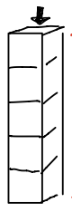

スタックは天井だけ空いているイメージ。天井からしかデータを出し入れできない。

次のようなデータがあるとき、データをスタックに入れたり出したりすることを考える。

| 学籍番号 | 点数 |
| --- | --- |
| 1 | 10 |
| 2 | 20 |
| 3 | 30 |
| 4 | 40 |
| 5 | 50 |

#### プッシュ : データを追加する作業

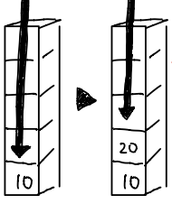

後入れ先出し方式 : LIFO(Last in First out)

データを下部から順に積んでいき必要に応じて上部から取り出す。


#### ポップ : データを取り出す作業

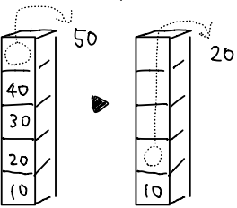


### プッシュの手順

1. スタックポインタ`sp`の位置にデータを追加
2. スタックポインタ`sp`を繰り上げる

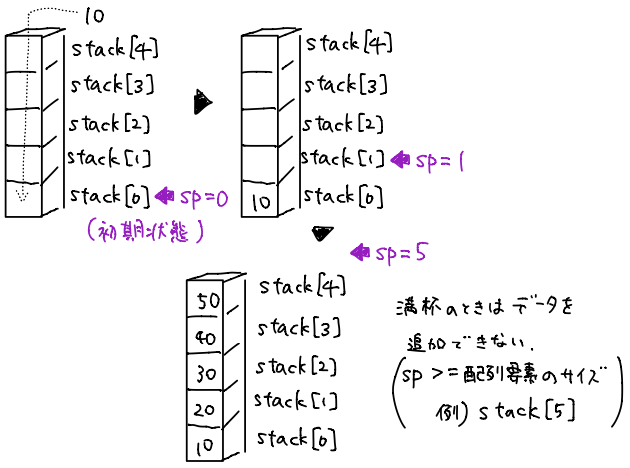

### ポップの手順

1. スタックポインタ`sp`を繰り下げる
2. スタックポインタ`sp`の位置のデータを取り出す

スタックが空の時(sp <= 0)はデータを取り出せない

### 実装してみよう
```c
#include<stdio.h>
#define SIZE 5 // SIZEを数値定数5として置換
int stack[SIZE]; // 配列を利用してスタックを作成
int sp; // スタックポインタ
void push(int value); // プロトタイプ宣言（関数の名前や引数、データ型などを定義）
int pop(void);
int main(void){
    sp = 0;int resp,data; // 初期化、変数宣言
    while(1){
        printf("1:push 2:push 0:end: ");
        scanf("%d",&resp); // スタックの操作はrespで決定
        if(!resp) break; // resp=0:操作終了
        switch(resp){
          case 1: printf("push:"); scanf("%d",&data); push(data); break; // resp=1:データ追加
          case 2: pop(); break; // resp=2:データ抽出
        }
        printf("sp=%d\n",sp);
    }
    printf("\n");
    for(int i = 0;i < sp;i++){
        printf("stack[%d]=%d\n",i,stack[i]); // スタック内のデータを表示
    }
    return 0;
}
void push(int value){ // データを追加する関数
    if(sp >= SIZE){ // スタックが満杯か
        printf("スタックが満杯で入りませんでした\n");
    }else{stack[sp++] = value;}
}
int pop(void){ // データを抽出する関数
    if(sp <= 0){ // スタックが空か
        printf("スタックが空で取り出せませんでした\n");
        return 0;
    }else{return stack[--sp];}
}
```


<a id="anchor4"></a>

## 4. キュー

### イメージ


キューはどちらも空いているイメージ。片側からデータを入れ、反対側から取り出す。

次のようなデータがあるとき、データをキューに入れたり出したりすることを考える。

| 学籍番号 | 点数 |
| --- | --- |
| 1 | 10 |
| 2 | 20 |
| 3 | 30 |
| 4 | 40 |
| 5 | 50 |
| 6 | 60 |

#### エンキュー : データを追加する作業(規則:最後尾に入れる)

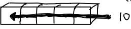

先入れ先出し方式 : FIFO(First in First out)

#### デキュー: データを取り出す作業(先頭から取り出す)

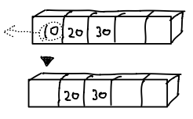

先に入れたデータから順に取り出す。

デキューした後にエンキューを続けると次のようになる。

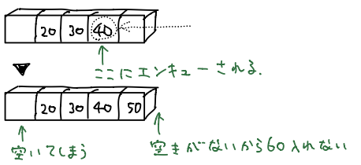

キューに空きがあるにも関わらず60を入れることができない。
この場合には、キューをリングとみなすリングバッファで解決。

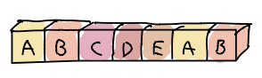


### キューを理解する

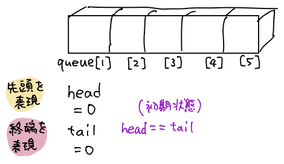

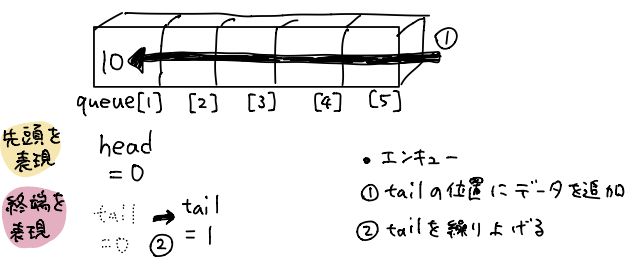

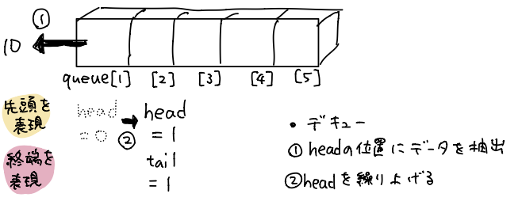

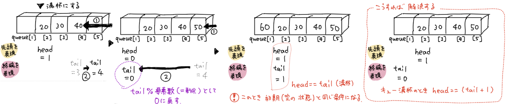


### 実装してみよう

```c
#include<stdio.h>
#define SIZE 5 // SIZEを数値定数5として置換
int queue[SIZE]; // 配列を利用してキューを作成
int head,tail; // エンキュー、デキューする位置
void enqueue(int value); // プロトタイプ宣言（関数の名前や引数、データ型などを定義）
int dequeue(void);
int main(void){
    head = tail = 0;int resp,data,i; // 初期化、変数宣言
    while(1){
        printf("1:enqueue 2:dequeue 0:end: ");
        scanf("%d",&resp); // キューへの操作はrespで決定
        if(!resp) break;
        switch(resp){
            case 1: printf("enqueue:"); scanf("%d",&data); enqueue(data); break;
            case 2: dequeue(); break;
        }
        printf("head=%d,tail=%d\n",head,tail); // head,tailの現在位置を表示
    }
    printf("\n");
    i=head;
    while(i =! tail){
        printf("queue[%d]=%d\n",i,queue[i]); // キュー内のデータ表示（headからtailまで）
        i++; i=i%SIZE;
    }
    return 0;
}
void enqueue(int value){ // データを追加する関数
    if(head == (tail + 1) % SIZE){
        printf("キューが満杯で入りませんでした\n");
    }else{queue[tail++] = value;}
    tail = tail % SIZE;
}
int dequeue(void){ // データを抽出する関数
    int value;
    if(head == tail){
        printf("キューが空で取り出せませんでした\n");
        return 0;
    }else{
        value = queue[head++];
        head = head % SIZE;
        return value;}
}
```


<a id="anchor5"></a>

## 5. 変数のアドレス

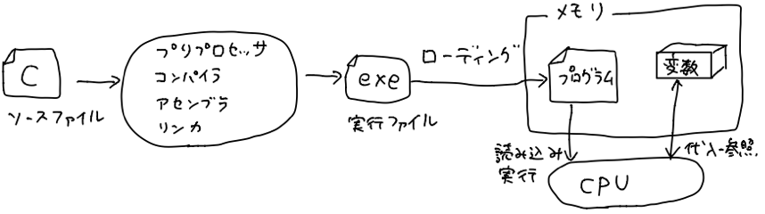

メモリ内の"変数の値を記憶しておく箱"の番地をアドレスという。

変数を宣言すると、適当なアドレスが自動的に割り振られる。

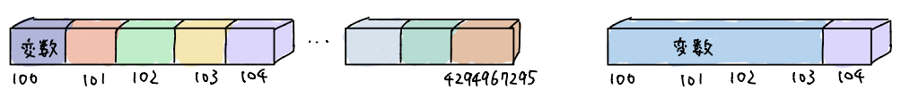

1つの箱には1バイト(=8bit)分の値しか入らない。

そのため、char型(8bit)は箱1つ、int型(32bit)は箱4つ使う。

```c
#include<stdio.h>
int main(void){
    int a;
    printf("変数aのアドレス&a=%p\n",&a);
    return 0;
}
```
> 変換指定子 %p : 変数のアドレスを表示したいときに使う
>
> アドレス演算子 & : アドレスを表示したい時に使う

実行結果
```
変数aのアドレス&a=0x7ffee3cb7b48
```
実行結果として表示されたアドレスは変数aの格納されている箱の先頭のアドレスを16進数表記したものである。


メモリマップによる表現では、縦に箱を重ねていき箱の中にアドレスを記入する。

(例)`int a`のメモリマップ(intは4バイトなので箱4つ)
| |
| --- |
| 0x08 |
| 0x09 |
| 0x0a |
| 0x0b |

```c
#include<stdio.h>
int main(void){
    int a;
    printf("int: %lu: %p\n",sizeof(a),&a);
    return 0;
}
```
> 変換指定子 %lu : 符号なし10進数を表示したいときに使う
>
> sizeof演算子 : データサイズ(バイト数)を知りたい時に使う

実行結果
```
int: 4: 0x7ffee3cb7b48
```

変数2つでメモリマップを作ってみる

```c
#include<stdio.h>
int main(void){
    int a;double b;
    printf("int: %lu: %p\n",sizeof(a),&a);
    printf("double: %lu: %p\n",sizeof(b),&b);
    return 0;
}
```

実行結果
```
int: 4: 0x7ffee3cb7b48
double: 8: 0x7ffee3cb7b40
```

実行結果から分かるように、変数宣言順にメモリに配置されるわけではない。

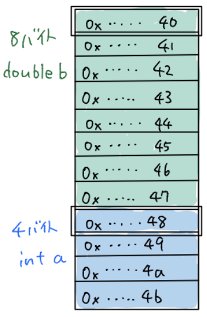

変数を増やしてメモリマップを作ると、連続するアドレスのメモリ上に未使用の領域ができることがある。
この未使用の領域をパディングという。パディングは未使用の領域を作ることで各変数の先頭位置を調整し、
コンパイラが隣接データへのアクセスを高速化するために発生する。

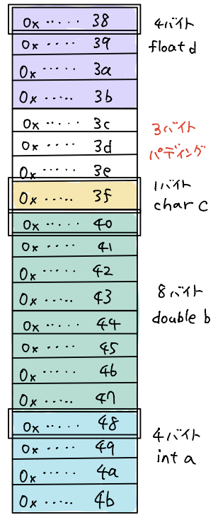


<a id="anchor6"></a>

## 6. 変数へのポインタ

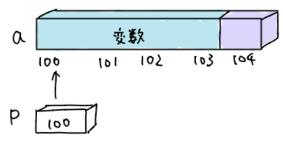

アドレスを格納する変数pをポインタという。pに変数aのアドレスが入っていることを"pはaを指している"という。

ポインタpが変数aを指すと、間接参照ができるようになる(アドレスを介して変数aの値を参照できる)。

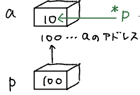

`*p`のように間接参照演算子`*`をつけることで表現する。

`*p`は"pの指す先(=変数a)の値(=10)"。`*p`に別の数値を代入すると変数aの値も変わる。


### ポインタで変数を指してみよう

```c
#include<stdio.h>
int main(void){
    int a = 10;
    int *p; // int*型の変数pを宣言
    p = &a; // pにaのアドレスを格納
    printf("変数aのアドレス&a= %p\n",&a); // アドレスを表示するための変換指定は%p
    printf("ポインタ変数pのアドレス p= %p\n",p); // pの中身 &a を表示
    return 0;
}
```
> `int *p` : intへのポインタ

実行結果
```
変数aのアドレス&a= 0x7ffeee6b2b48
ポインタ変数pのアドレス p= 0x7ffeee6b2b48
```
どちらのアドレスも同じになっていることが確認できる。

### ポインタで値を変更してみよう

```c
#include<stdio.h>
int main(void){
    int a = 10;
    int *p; // int*型の変数pを宣言
    p = &a; // pにaのアドレスを格納
    *p = 100; // ポインタpの指す先である変数aの値を100に変更
    printf("変数aの値= %d\n",a);
    return 0;
}
```
実行結果
```
変数aの値= 100
```


<a id="anchor7"></a>

## 7. 値渡しとポインタ渡し

- 値渡しでは、引数は関数の呼び出し元から呼び出された先の関数に渡し、戻す時は"戻り値"を使って戻す(戻り値は1つ以下)。
- ポインタ渡しでは、戻り値だけではなく引数も使うことで0個以上戻すことができる。

### 値渡しを使ったswap関数

```c
#include<stdio.h>
void swap(int a,int b); // プロトタイプ宣言
int main(void){
    int a = 3,b = 5;
    swap(a,b); // 関数呼び出し
    printf("a=%d,b=%d\n",a,b);
    return 0;
}
void swap(int a,int b){
    int w;
    w = a;
    a = b;
    b = w;
}
```
実行結果
```
a=3,b=5
```
swap関数側のa,bはエイリアスではないので、main側のa,bには影響がない。

イメージ

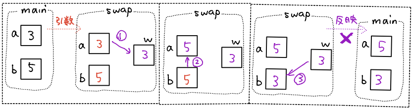

### ポインタ渡しを使ったswap関数

```c
#include<stdio.h>
void swap(int *a,int *b); // プロトタイプ宣言
int main(void){
    int a = 3,b = 5;
    swap(&a,&b); // 関数呼び出し
    printf("a=%d,b=%d\n",a,b);
    return 0;
}
void swap(int *a,int *b){
    int w;
    w = *a;
    *a = *b;
    *b = w;
}
```
実行結果
```
a=5,b=3
```
aのアドレスとbのアドレスがswapされるので、swap関数内でmain関数の変数a,b(実体)を操作できている。

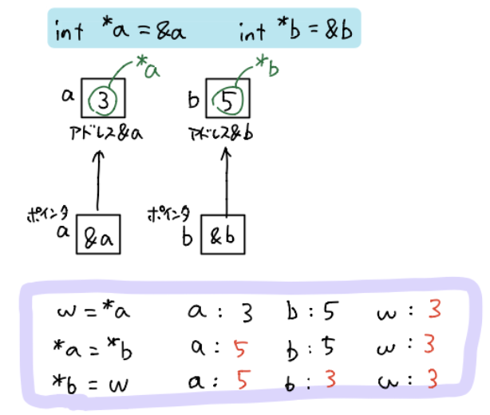


<a id="anchor8"></a>

## 8. 関数へのポインタ

関数の先頭アドレスを値として持つポインタのことを関数へのポインタという。

ポインタで関数を表してみよう

```c
#include<stdio.h>
int add(int x,int y);
int main(void){
    int a = 2,b = 3;
    int ans;
    int (*pm)(int x,int y); // 関数ポインタの宣言
    pm = add; // 関数ポインタpmにadd関数のアドレス代入
    ans = (*pm)(a,b); // add関数の呼び出し
    printf("ans=%d\n",ans);
    return 0;
}
int add(int x,int y){
    return x + y;
}
```
実行結果
```
ans=5
```

> `(*pm)(a,b)`は`add(a,b)`と同じ意味になる
>
> 関数ポインタpmの宣言 : `(*関数ポインタ)(引数,引数,…)`
>
> 関数ポインタで指す`add()`と引数の数を揃える必要がある


<a id="anchor9"></a>

## 9. 配列のアドレス

表し方
```c
#include<stdio.h>
int main(void){
    int a[3] = {1,2,3};
    for(int i = 0;i < 3;i++){
        printf("a[%d]のアドレス:%p,\n",i,&a[i]);
        printf("a+%d:         %p,\n",i,a+i);
    }
    return 0;
}
```
実行結果
```
a[0]のアドレス:0x7ffeed08bb0c,
a+0:         0x7ffeed08bb0c,
a[1]のアドレス:0x7ffeed08bb10,
a+1:         0x7ffeed08bb10,
a[2]のアドレス:0x7ffeed08bb14,
a+2:         0x7ffeed08bb14,
```

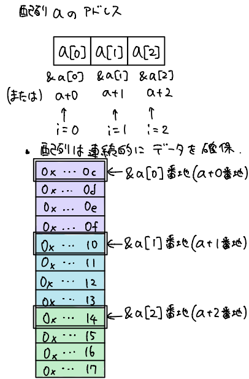


ポインタに配列のアドレスを入れてみよう
```c
#include<stdio.h>
int main(void){
    int a[3] = {1,2,3};
    int *p = a; // 配列名aは先頭アドレス&a[0]と同じ意味
    for(int i = 0;i < 3;i++){
        printf("&a[%d]のアドレス:%p,\n",i,&a[i]);
        printf("&p[%d]のアドレス:%p,\n",i,&p[i]);
    }
    return 0;
}
```
実行結果
```
&a[0]のアドレス:0x7ffeed08bb8c,
&p[0]のアドレス:0x7ffeed08bb8c,
&a[1]のアドレス:0x7ffeed08bb90,
&p[1]のアドレス:0x7ffeed08bb90,
&a[2]のアドレス:0x7ffeed08bb94,
&p[2]のアドレス:0x7ffeed08bb94,
```


<a id="anchor10"></a>

## 10. ポインタ演算

ポインタpに加減算をしてポインタpが指す先のアドレスを切り換える演算(ポインタ演算)をしても同じ結果を得ることを確かめる。
```c
#include<stdio.h>
int main(void){
    int a[3] = {1,2,3};
    int *p = a; // 配列名aは先頭アドレス&a[0]と同じ意味
    for(int i = 0;i < 3;i++){
        printf("a[%d]のアドレス:%p,\n",i,a+i);
        printf("ポインタ演算p+%d:%p,\n",i,p+i);
    }
    return 0;
}
```
実行結果
```
a[0]のアドレス:0x7ffeed08bb8c,
ポインタ演算p+0:0x7ffeed08bb8c,
a[1]のアドレス:0x7ffeed08bb90,
ポインタ演算p+0:0x7ffeed08bb90,
a[2]のアドレス:0x7ffeed08bb94,
ポインタ演算p+0:0x7ffeed08bb94,
```


<a id="anchor11"></a>

## 11. ポインタによる配列表示

ポインタを使って配列の値を見てみよう
```c
#include<stdio.h>
int main(void){
    int a[3] = {1,2,3};
    int *p = a; // ポインタpが配列aを指したことでエイリアス(別名)ができた
    for(int i = 0;i < 3;i++){
        printf("a[%d]:%d\n",i,a[i]);
        printf("p[%d]:%d\n",i,p[i]); // ここで printf("*(p+%d):%d\n",i,*(p+i));としても同じ結果を得る
    }
    return 0;
}
```
実行結果
```
a[0]:1
p[0]:1
a[1]:2
p[1]:2
a[2]:3
p[2]:3
```

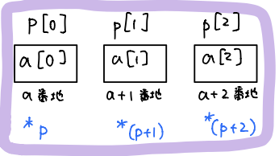


<a id="anchor12"></a>

## 12. 配列とポインタの違い

### ここまでのまとめ
```c
int a[3];
int *p = a; // 型は揃える。配列名は配列の先頭要素を指すポインタ
```

|i番目のアドレス|i番目の要素|
|---|---|
|&a[i]|a[i]|
|a+i|\*(a+i)|
|p+i|\*(p+i)|
|&p[i]|p[i]|

これらは全て同じアドレス、要素の値を指す。

ポインタpが指す先である配列aのアドレスがpには入っている。

<details>

<summary>確かめるためのコード</summary>

```c
#include<stdio.h>
int main(void){
    int a[3] = {1,2,3};
    int *p = a;
    for(int i = 0;i < 3;i++){
        printf("&a[%d]:%d,%d\n",i,&a[i],a[i]);
        printf("a+%d:%d,%d\n",i,a+i,*(a+i));
        printf("p+%d:%d,%d\n",i,p+i,*(p+i));
        printf("&p[%d]:%d,%d\n",i,&p[i],p[i]);
    }
    return 0;
}
```

</details>

ポインタp自身のアドレスは&pである。

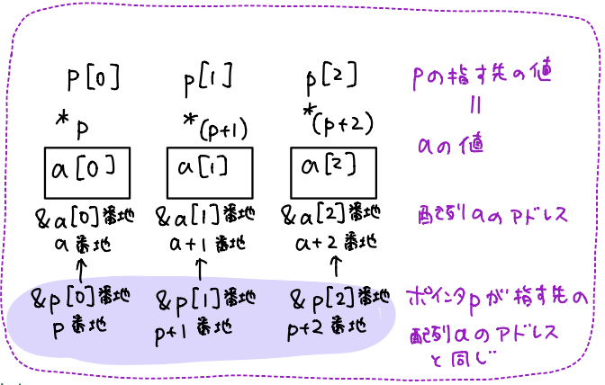


### 配列とポインタの違い

- ポインタの場合
```c
#include<stdio.h>
int main(void){
    int a[3] = {1,2,3};
    int *b;
    b = a; // 代入可能。 ポインタb = 配列aのアドレス
    for(int i = 0;i < 3;i++){
        printf("配列a[%d]:%d\n",i,*(b+i));
    }
    return 0;
}
```
実行結果
```
配列a[0]:1
配列a[1]:2
配列a[2]:3
```


- 配列の場合
```c
#include<stdio.h>
int main(void){
    int a[3] = {1,2,3};
    int b[3];
    b = a; // 配列ではアドレスの書き換えはできない
    for(int i = 0;i < 3;i++){
        printf("配列a[%d]:%d\n",i,*(b+i));
    }
    return 0;
}
```
実行結果
```
error: assignment to expression with array type
     b = a;
       ^
```


<a id="anchor13"></a>

## 13. 配列の受け渡し

関数の引数に配列を渡したい

```c
#include<stdio.h>
void change(int a[]);
int main(void){
    int b[5] = {1,2,3,4,5};
    change(b); // bは&b[0]を表す。change(配列bの先頭アドレス)
    return 0;
}
void change(int a[]){ // int a[]は配列に見えるがポインタ宣言(int *aと同じ意味)
    for(int i = 0;i < 5;i++){ // 配列bの先頭要素へのポインタなので要素数は別引数で渡す必要がある
        a[i] += 1; // ポインタaがbの先頭アドレスを受け取ることでmain側の配列b(実体)を操作
        printf("%d",a[i]);
    }
    printf("\n");
}
```
実行結果
```
23456
```

関数に配列の要素数を渡したい

```c
#include<stdio.h>
void display(int a[],int n);
int main(void){
    int b[5] = {1,2,3,4,5};
    int size = sizeof(b) / sizeof(b[0]); // 要素数の算出はsizeof演算子を利用
    display(b,size); // display(配列bの先頭アドレス,値のコピー)
    return 0;
}
void display(int a[],int n){ // int n = size,int a[] = b, bは実体なのでmain側に影響を与える可能性がある
    for(int i = 0;i < n;i++){
        printf("%d",a[i]);
    }
    printf("\n");
}
```
> sizeof演算子(大きさ生成) : `sizeof(b)/sizeof(b[0])` = '配列全体'/'要素1個'

実行結果
```
12345
```


<a id="anchor14"></a>

## 14. const

constをつけてミスを防ごう

constをつけると変数の値を変更せず定数として宣言でき、読み取り専用となる。
値を変更しようとするとコンパイルエラーが発生するのでミスに気づける。


```c
#include<stdio.h>
void display(const int a[],int n);
int main(void){
    int b[5] = {1,2,3,4,5};
    int size = sizeof(b) / sizeof(b[0]);
    display(b,size);
    return 0;
}
void display(int a[],int n){ // const int a[] = bでmain側の配列bの値は変更不可
    for(int i = 0;i < n;i++){
        printf("%d",a[i]);
    }
    printf("\n");
}
```
実行結果
```
12345
```


<a id="anchor15"></a>

## 15. ポインタの配列

ここまでは1つのポインタで操作していた。ポインタの配列は、複数のポインタを操作するための配列である。

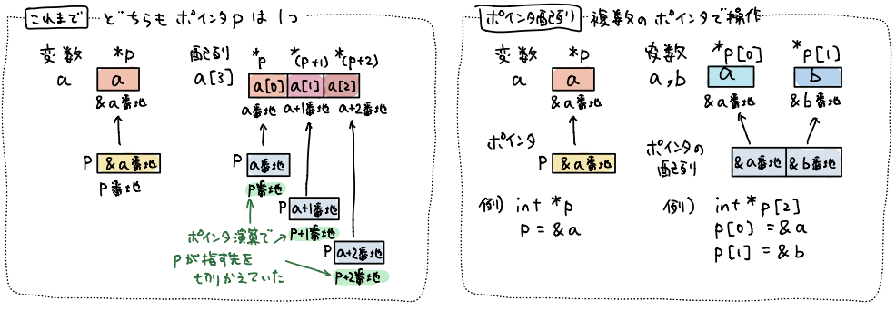

ポインタの配列を使って変数のアドレスと値を見てみよう

```c
#include<stdio.h>
int main(void){
    int a = 1,b = 2;
    int *p[2]; // ポインタの配列の宣言(int *[]型)
    p[0] = &a; p[1] = &b; // 変数a,bのアドレスを代入
    printf("変数a: %p,%d\n",&a,a);
    printf("変数b: %p,%d\n",&b,b);
    for(int i = 0;i < 2;i++){
        printf("ポインタの配列p[%d]:%p,%d\n",i,p[i],*p[i]);
    }
    return 0;
}
```
実行結果
```
変数a: 0x7ffee0902af8,1
変数b: 0x7ffee0902af4,2
ポインタの配列p[1]:0x7ffee0902af8,1
ポインタの配列p[2]:0x7ffee0902af4,2
```


<a id="anchor16"></a>

## 16. ダブルポインタの利用

ポインタの配列の受け渡しをしたい

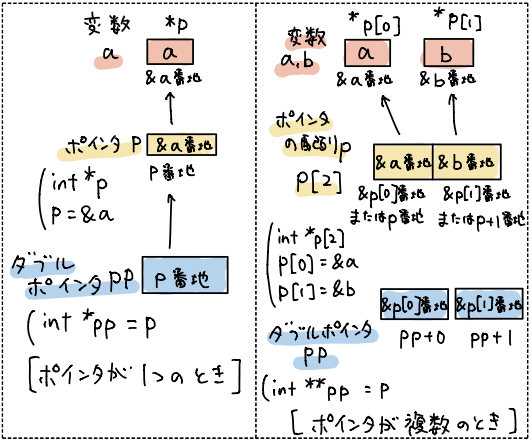

- "ポインタpを指すポインタpp"をダブルポインタppという。
- ポインタppを使って変数aの実体を操作する。
- ダブルポインタppはポインタpを引数として関数側に渡したい時に利用できる。
- ポインタが複数時、ポインタ演算を使うことでダブルポインタppはポインタ配列pを操作できる。

```c
#include<stdio.h>
void change(int *pp[],int n);
int main(void){
    int a = 1,b = 2;
    int *p[2] = {&a,&b}; // ポインタの配列の宣言,初期化
    int size = sizeof(p) / sizeof(p[0]);
    change(p,size); //pは&p[0]
    printf("変数aの値: %d\n",a);
    printf("変数bの値: %d\n",b);
    return 0;
}
void change(int *pp[],int n){ // int *pp[]はint **ppと同じ意味
    for(int i = 0;i < n;i++){
        *pp[i] += 1;
    }
}
```
実行結果
```
変数aの値: 2
変数bの値: 3
```


<a id="anchor17"></a>

## 17. 2次元配列の宣言と初期化

1次元配列 : `データ型名 配列名[要素数] = {要素[1],要素[2],…};`

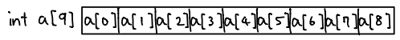

- 大量のデータを扱える
- 添字を使うことで要素に直接アクセスできる
- 要素数を超えて追加できない
- 要素数を事前に確定する必要がある
- データの追加,削除が面倒

2次元配列 : `データ型名 配列名[行要素数][列要素数] = {{要素[0][0],要素[0][1],…},{要素[1][0],要素[1][1],…}};`

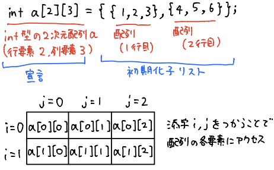

```c
#include<stdio.h>
int main(void){
    int x[2][3] = {{1,2,3},{4,5,6}};
    for(int i = 0;i < 2;i++){
        for(int j = 0;j < 3;j++){
            printf("%d ",x[i][j]);
        }
    	putchar('\n');
    }
    return 0;
}
```
実行結果
```
1 2 3
4 5 6
```

配列間を区切らなくてもいい。`int x[2][3]={{1,2,3},{4,5,6}};`は`int x[2][3]={1,2,3,4,5,6};`でいい。

最初の要素数を書かなくてもいい。`int x[][3]={1,2,3,4,5,6};`でもいい。

初期値を省略すると0が自動入力される。`int x[2][3]={{1},{4,5,6}};`は`int x[2][3]={{1,0,0},{4,5,6}};`と同じ。


<a id="anchor18"></a>

## 18. 2次元配列のアドレスとメモリ

```c
#include<stdio.h>
int main(void){
    int x[2][3] = {1,2,3,4,5,6};
    puts("配列の各要素のアドレス");
    for(int i = 0;i < 2;i++){
        for(int j = 0;j < 3;j++){
            printf("%p ",&x[i][j]);
        }
    	putchar('\n');
    }
    putchar('\n');
    puts("配列の各要素の大きさ");
    for(int i = 0;i < 2;i++){
    	  for(int j = 0;j < 3;j++){
    		  printf("%lu ",sizeof(x[i][j]));
    	  }
    	  putchar('\n');
    }
    return 0;
}
```
実行結果
```
配列の各要素のアドレス
0x7ffd6b326e00 0x7ffd6b326e04 0x7ffd6b326e08
0x7ffd6b326e0c 0x7ffd6b326e10 0x7ffd6b326e14

配列の各要素の大きさ
4 4 4
4 4 4
```

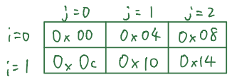

1行目、2行目、…と連続的に配置される。(コンパイラは列要素数で配列の区切りを判断している)


<a id="anchor19"></a>

## 19. 2次元配列へのポインタ

`int a[2][3]`のアドレスをポインタpで指すことを考える。

`int (*p)[3] = a` で、aは配列名(配列の行の先頭要素a[0]のアドレス&a[0])

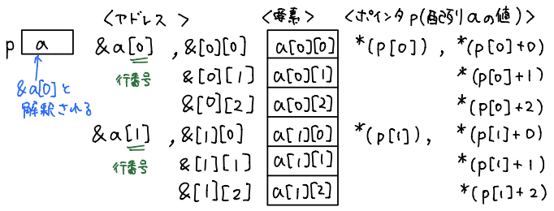

```c
#include<stdio.h>
int main(void){
    int a[2][3] = {1,2,3,4,5,6};
    int (*p)[3] = a;
    printf("a[0]の値    :%d\n",*(p[0]));
    printf("a[0][0]の値 :%d\n",*(p[0]+0));
    printf("a[0][1]の値 :%d\n",*(p[0]+1));
    printf("a[0][2]の値 :%d\n",*(p[0]+2));
    printf("a[1]の値    :%d\n",*(p[1]));
    printf("a[1][0]の値 :%d\n",*(p[1]+0));
    printf("a[1][1]の値 :%d\n",*(p[1]+1));
    printf("a[1][2]の値 :%d\n",*(p[1]+2));
    return 0;
}
```
実行結果
```
a[0]の値    :1
a[0][0]の値 :1
a[0][1]の値 :2
a[0][2]の値 :3
a[1]の値    :4
a[1][0]の値 :4
a[1][1]の値 :5
a[1][2]の値 :6
```


<a id="anchor20"></a>

## 20. 2次元配列の受け渡し

`int a[2][3]`を関数側に渡すことを考える。

関数の呼び出し側 :
```
func(a) : aは配列名(配列の行の先頭要素a[0]のアドレス&a[0])
```

関数側 :
```
パターン1 そのまま書く  void func(int p[2][3])
パターン2 先頭の添字を省略  void func(int p[][3])
パターン3 配列のポインタで表記  void func(int (p*)[3])

実体を受け取るので関数側で変更可能。列数は定数[固定]、行数は任意。
```

```c
#include<stdio.h>
void fill(int m[2][5],int n,int v);
void display(const int m[2][5],int n);
int main(void){
    int x[2][5] = {0};
    int no;
    printf("すべての構成要素に代入する値:");
    scanf("%d",&no);
    printf("%d\n",no);
    fill(x,2,no); // fill(&x[0],行要素数,代入値)
    printf("xの配列\n");
    display(x,2); // display(&x[0],行要素数)
    return 0;
}
void fill(int m[2][5],int n,int v){ // int m[2][5]=x,int v=no
	  for(int i = 0;i < n;i++){
		    for(int j = 0;j < 5;j++){
			      m[i][j] = v;
		    }
	   }
}
void display(const int m[2][5],int n){ // const int m[2][5]=x
	  for(int i = 0;i < n;i++){
		    for(int j = 0;j < 5;j++){
			      printf("%d",m[i][j]);
		    }
		    putchar('\n');
	  }
}
```
実行結果
```
すべての構成要素に代入する値:2
xの配列
22222
22222
```


<a id="anchor21"></a>

## 21. 構造体の指定子と定義

### 構造体とは

自分自身で定義する新しい型。異なる型のデータを1つの変数で扱うことができる。

(例)学生の健康診断データ

|||
|---|---|
|学籍番号|int id|
|血液型|char blood_type|
|身長|double height|

まとめて管理した方がいい変数は構造体を使う。多数のグローバル変数をまとめたり、関数の引数の数を減らすのに使う。

->可読性を上げることができる。引数の順序間違いによるバグの抑制になる。関数呼び出しのオーバーヘッド(余分負荷)を減らせる。


### 構造体指定子の書式

`struct タグ名`という新しい型を作る。
```
struct タグ名{
  型名 メンバー名;
  型名 メンバー名;
  型名 メンバー名;
};
```

(例)
```c
struct student{
    int id;
    char blood_type;
    double height;
};
```

構造体型の変数の宣言は`struct タグ名 変数名;`で行う。

(例)`struct student asano` : `struct student`が新しい型名となり、`asano`が変数名となる。

### メンバーへのアクセスと代入

`変数名.メンバー名 = 数値;` `変数名.メンバー名 = '文字';`

(例)`asano.id = 1;` `asano.blood_type = 'A'`

```c
#include<stdio.h>
struct student{ // 構造体指定子の定義
    int id;
    char blood_type;
    double height;
};
int main(){
    struct student asano; // struct student型変数asanoを宣言(初期化子がなければ0で初期化)。
    asano.id = 1; // struct student型変数asanoのメンバーに代入
    asano.blood_type = 'A';
    asano.height = 165.2;
    printf("id         :%d \n",asano.id); // struct student型変数asanoのメンバーを表示
	  printf("blood_type :%c \n",asano.blood_type);
	  printf("height     :%lf \n",asano.height);
    return 0;
}
```
実行結果
```
id         :1
blood_type :A
height     :165.200000
```


<a id="anchor22"></a>

## 22. メンバーの初期化

```c
#include<stdio.h>
struct student{
    int id;
    char blood_type;
    double height;
};
int main(){
    struct student asano = {1, 'A', 165.2}; // 構造体変数の宣言と初期化。メンバーの順番に合わせて書く。
    struct student yoshino = {2, .height = 155.5}; // ドット演算子を使って3番目のメンバーを初期化。途中の初期化を飛ばせる。
    printf("id         :%d \n",asano.id);
    printf("blood_type :%c \n",asano.blood_type);
    printf("height     :%lf \n",asano.height);
    printf("id         :%d \n",yoshino.id);
    printf("blood_type :%c \n",yoshino.blood_type);
    printf("height     :%lf \n",yoshino.height);
    return 0;
}
```
実行結果
```
id         :1
blood_type :A
height     :165.200000
id         :2
blood_type :
height     :155.500000
```

```c
#include<stdio.h>
struct student{
    int id;
    char blood_type;
    double height;
};
int main(){
    struct student asano = {0}; // 最初のメンバーのみ記述するとその後のメンバーは0で初期化される。(ポインタならNULLで初期化)
    struct student yoshino = {1};
    printf("id         :%d \n",asano.id);
    printf("blood_type :%c \n",asano.blood_type);
    printf("height     :%lf \n",asano.height);
    printf("id         :%d \n",yoshino.id);
    printf("blood_type :%c \n",yoshino.blood_type);
    printf("height     :%lf \n",yoshino.height);
    return 0;
}
```
実行結果
```
id         :0
blood_type :
height     :0.000000
id         :1
blood_type :
height     :0.000000
```


<a id="anchor23"></a>

## 23. 構造体指定子の定義・変数宣言をまとめる

```c
#include<stdio.h>
struct student{
    int id;
    char blood_type;
    double height;
}asano,yoshino;
int main(){
    asano.id = 1;
    asano.blood_type = 'A';
    asano.height = 165.2;
    yoshino.id = 2;
    yoshino.blood_type = 'O';
    yoshino.height = 155.5;
    printf("id         :%d \n",asano.id);
    printf("blood_type :%c \n",asano.blood_type);
    printf("height     :%lf \n",asano.height);
    printf("id         :%d \n",yoshino.id);
    printf("blood_type :%c \n",yoshino.blood_type);
    printf("height     :%lf \n",yoshino.height);
    return 0;
}
```

初期化までまとめると
```c
#include<stdio.h>
struct student{
    int id;
    char blood_type;
    double height;
}asano={1, 'A', 165.2},yoshino={2, 'O', 155.5};
int main(){
    printf("id         :%d \n",asano.id);
    printf("blood_type :%c \n",asano.blood_type);
    printf("height     :%lf \n",asano.height);
    printf("id         :%d \n",yoshino.id);
    printf("blood_type :%c \n",yoshino.blood_type);
    printf("height     :%lf \n",yoshino.height);
    return 0;
}
```


<a id="anchor24"></a>

## 24. 構造体の変数をあとから追加

```c
#include<stdio.h>
#include<string.h> // 文字列を操作する関数が定義できる
struct student{
    int id; char blood_type; double height;
}asano={1, 'A', 165.2},yoshino={2, 'O', 155.5};
int main(){
    struct student ikeda = {3, 'B', 175.0}; // 後から追加できる
    printf("id         :%d \n",asano.id);
    printf("blood_type :%c \n",asano.blood_type);
    printf("height     :%lf \n",asano.height);
    printf("id         :%d \n",yoshino.id);
    printf("blood_type :%c \n",yoshino.blood_type);
    printf("height     :%lf \n",yoshino.height);
    return 0;
}
```


<a id="anchor25"></a>

## 25. 無名構造体

```c
#include<stdio.h>
#include<string.h>
struct{ // 無名構造体 : タグ名が省略された構造体
    int id; char blood_type; double height;
}asano={1, 'A', 165.2}, yoshino={2, 'O', 155.5};
int main(){
    // struct student ikeda = {3, "ikeda", 175.0};のように後から追加はできない
    printf("id         :%d \n",asano.id);
    printf("blood_type :%c \n",asano.blood_type);
    printf("height     :%lf \n",asano.height);
    printf("id         :%d \n",yoshino.id);
    printf("blood_type :%c \n",yoshino.blood_type);
    printf("height     :%lf \n",yoshino.height);
    // printf("id         :%d \n",ikeda.id);
    // printf("blood_type :%c \n",ikeda.blood_type);
    // printf("height     :%lf \n",ikeda.height);
    return 0;
}
```


<a id="anchor26"></a>

## 26. 構造体をコピー

```c
#include<stdio.h>
struct student{
    int id; char blood_type; double height;
};
int main(){
    struct student asano = {1, 'A', 165.2};
    struct student yoshino = asano; // 構造体変数asanoをまるごとコピー(配列ではこのようなコピーはできない)
    printf("id         :%d \nblood_type :%c \nheight     :%lf \n",asano.id,asano.blood_type,asano.height);
    printf("id         :%d \nblood_type :%c \nheight     :%lf \n",yoshino.id,yoshino.blood_type,yoshino.height);
    return 0;
}
```
実行結果
```
id         :1
blood_type :A
height     :165.200000
id         :1
blood_type :A
height     :165.200000
```


<a id="anchor27"></a>

## 27. 構造体を格納する配列

```c
#include<stdio.h>
struct student_list{
    int id; char blood_type; double height;
};
int main(){
    struct student_list data[] = { // 構造体を格納する配列data、配列の各要素が構造体
        {1, 'A', 165.2},
        {2, 'O', 155.5},};
    for(int i = 0;i < 2;i++){
        printf("id         :%d \n", data[i].id); // 配列の添字を使って各構造体のメンバーにアクセス
        printf("blood_type :%c \n", data[i].blood_type);
        printf("height     :%lf \n", data[i].height);
    }
    return 0;
}
```
実行結果
```
id         :1
blood_type :A
height     :165.200000
id         :2
blood_type :O
height     :155.500000
```


<a id="anchor28"></a>

## 28. typedefの利用

### 同義語の新しい型を作る

```c
#include<stdio.h>
typedef struct student_list{
    int id; char blood_type; double height;
}list; // typedefによりstruct student_listはlistという同義語に置き換えられる
int main(){
    list data[]={
        {1, 'A', 165.2}, // structの表記不要
        {2, 'O', 155.5},};
    for(int i = 0;i < 2;i++){
        printf("id         :%d \n", data[i].id);
        printf("blood_type :%c \n", data[i].blood_type);
        printf("height     :%lf \n", data[i].height);
    }
    return 0;
}
```
### タグ名の省略
```c
#include<stdio.h>
typedef struct{
    int id; char blood_type; double height;
}list; // typedef + 無名構造体
int main(){
    list data[]={
        {1, 'A', 165.2},
        {2, 'O', 155.5},};
    for(int i = 0;i < 2;i++){
        printf("id         :%d \n", data[i].id);
        printf("blood_type :%c \n", data[i].blood_type);
        printf("height     :%lf \n", data[i].height);
    }
    return 0;
}
```

### typedef と #define の違い

- typedefは、新しい型を作成するためのキーワードであるのに対し、defineは、置換マクロを定義するためのキーワードである(名前をただ置き換える)。
- typedefは、型名に対して新しい名前を定義することができる。一方、defineは、識別子（名前）に対してマクロを定義することができる。
- typedefは、コンパイラによって解釈される。defineは、プリプロセッサによって解釈される。
- typedefは、スコープの概念がある。一方、defineは、グローバルなスコープで定義される。
- typedefは、構造体に対しても使用することができる。一方、defineは、構造体に使用することができない。


<a id="anchor29"></a>

## 29. 構造体のメモリマップ

```c
#include<stdio.h>
#include<string.h>
struct student{
	  int id; char qst[2]; double height;
};
int main(){
    struct student asano;
    printf("struct student asano: %2lu, %p, \n",sizeof(asano),&asano);
    printf("int id              : %2lu, %p, \n",sizeof(asano.id),&asano.id);
    printf("qst[0]              : %2lu, %p, \n",sizeof(asano.qst[0]),&asano.qst[0]);
    printf("qst[1]              : %2lu, %p, \n",sizeof(asano.qst[1]),&asano.qst[1]);
    printf("double height       : %2lu, %p, \n",sizeof(asano.height),&asano.height);
    return 0;
}
```
実行結果
```
struct student asano: 24, 0x7ffe04fbfb80,
int id              :  4, 0x7ffe04fbfb80,
qst[0]              :  4, 0x7ffe04fbfb84,
qst[1]              :  4, 0x7ffe04fbfb88,
double height       :  8, 0x7ffe04fbfb90,
```
構造体asanoのメモリマップ

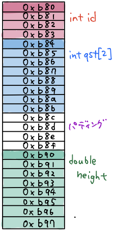


> 構造体では個々の変数とは異なり宣言順にメモリに配置される


<a id="anchor30"></a>

## 30. ポインタを持つ構造体

```c
#include<stdio.h>
typedef struct{ // typedef + 無名構造体
	  int id; int height; int *qst;
}data; // メンバーとしてポインタqstを宣言
int main(){
    int question = 5;
    data me = {1, 160, &question}; // int *qst = question ,ポインタqstはint型変数questionのアドレスを格納。
    printf("id    : %d \n",me.id);
    printf("height: %d \n",me.height);
    printf("*qst  : %d \n",*(me.qst));
    return 0;
}

```
実行結果
```
id    : 1
height: 160
*qst  : 5
```


<a id="anchor31"></a>

## 31. 構造体へのポインタ

```c
#include<stdio.h>
typedef struct{
	  int x; int y;
}coordinate;
int main(){
    coordinate me = {1, 2};
    coordinate *shadow = &me; // ポインタの宣言。構造体変数meのアドレスを格納。ポインタshadowはmeのエイリアス
    shadow -> x = 2; // アロー演算子は(*shadow).x = 2と同じ意味。*を使ってme(実体)を間接操作。
    shadow -> y = 3;
    printf("me(%d,%d) \n",me.x, me.y);
    printf("shadow(%d,%d) \n",shadow -> x, shadow -> y);
    return 0;
}
```
実行結果
```
me(2,3)
shadow(2,3)
```


<a id="anchor32"></a>

## 32. 構造体メンバーのコピーを渡す関数

```c
#include<stdio.h>
typedef struct{
	  int x; int y;
}coordinate;
void display(int x, int y);
int main(){
    coordinate me = {1, 2};
    display(me.x, me.y); // 関数呼び出しdisplay(xの値のコピー,yの値のコピー)
    return 0;
}
void display(int x, int y){ // int x = me.x, int y = me.y, コピーなのでメンバーには反映されない
	  printf("me(%d,%d) \n",x, y);
}
```
実行結果
```
me(1,2)
```


<a id="anchor33"></a>

## 33. 構造体のコピーを渡す関数

```c
#include<stdio.h>
typedef struct{
	  int x; int y;
}coordinate;
void display(coordinate player);
int main(){
    coordinate me = {1, 2};
    display(me); // 関数呼び出しdisplay(全メンバーの値コピー)
    return 0;
}
void display(coordinate player){ // coordinate player = me
	  printf("player(%d,%d) \n", player.x, player.y);
}
```
実行結果
```
player(1,2)
```


<a id="anchor34"></a>

## 34. 構造体を返す関数

```c
#include<stdio.h>
typedef struct{
  	int x; int y;
}coordinate;
coordinate move_x(coordinate player);
int main(){
    coordinate me = {1, 2};
    coordinate new_me = move_x(me); // 関数呼び出しmove_x(全メンバーの値コピー)
    printf("new_me(%d,%d) \n",new_me.x, new_me.y);
    return 0;
}
coordinate move_x(coordinate player){ // coordinate player = me
	  player.x += 1;
  	return player;
}
```
実行結果
```
new_me(2,2)
```


<a id="anchor35"></a>

## 35. 構造体へのポインタを渡す関数

構造体をまるごと渡すとデータ容量が大きくなるが、ポインタを使うことでデータ容量が軽くなる。

```c
#include<stdio.h>
typedef struct{
	  int x; int y;
}coordinate;
void move_x(coordinate *player);
int main(){
    coordinate me = {1, 2};
    move_x(&me);
    printf("me(%d,%d) \n",me.x, me.y);
    return 0;
}
void move_x(coordinate *player){ // coordinate *player = &me(構造体meの先頭アドレス)
	  player -> x += 1; // move_x内でme.xは+1され、mainでも反映される
}
```
実行結果
```
me(2,2)
```


<a id="anchor36"></a>

## 36. constで構造体へのポインタを渡す関数

```c
#include<stdio.h>
typedef struct{
	  int x; int y;
}coordinate;
void display(const coordinate *player);
int main(){
    coordinate me = {1, 2};
    display(&me);
    return 0;
}
void display(const coordinate *player){ // const coordinate *player = &me, 構造体playerのメンバーの値変更不可
	  printf("player(%d,%d) \n",player -> x, player -> y);
}
```
実行結果
```
player(1,2)
```


<a id="anchor37"></a>

## 37. 構造体の配列へのポインタを渡す関数

```c
#include<stdio.h>
typedef struct{
	  int id; char blood_type; double height;
}list;
void display(list data[]);
int main(){
	  list data[]={
		    {1, 'A', 165.2},
		    {2, 'O', 155.5},
	  };
	  display(data);
    return 0;
}
void display(list data[]){ // list data[] = data, list *data = data, ポインタの宣言
	  for(int i = 0;i < 2;i++){
		    printf("id        :%d \n",data[i].id);
		    printf("blood_type:%c \n",data[i].blood_type);
		    printf("height    :%lf \n",data[i].height);
	  }
}
```
実行結果
```
id        :1
blood_type:A
height    :165.200000
id        :2
blood_type:O
height    :155.500000
```
